# VTASK – Enterprise Workflow & Task Management Platform

## Overview

VTASK is a comprehensive enterprise workflow and workforce management platform designed to streamline task execution, employee management, project coordination, support operations, performance tracking, payment processing, and organizational communication.

Built with Laravel and modern web technologies, VTASK helps organizations improve productivity, accountability, collaboration, and workflow automation through a centralized management system.

## Live Demo

🔗 https://vtask.co

---

## VTASK Interface Preview

### Dashboard & Analytics
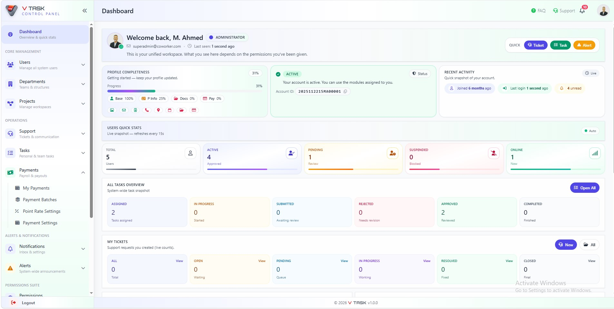

### Department Management
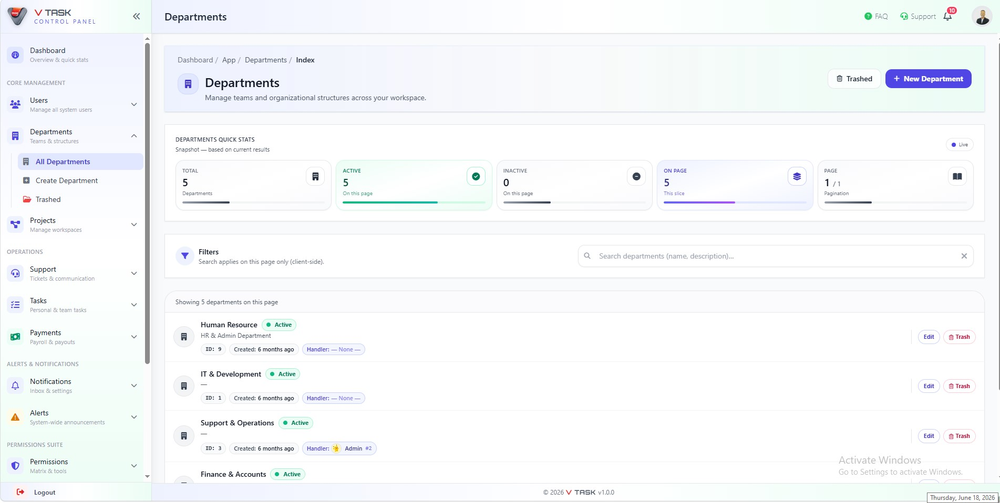

### Task Management & Workflow Automation
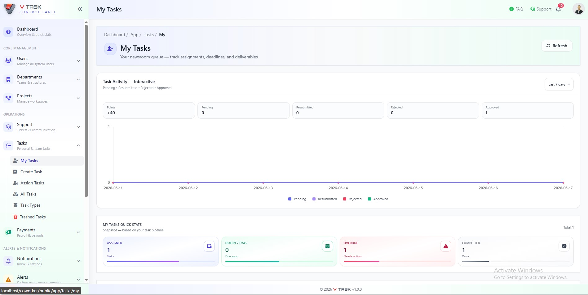

### User Management
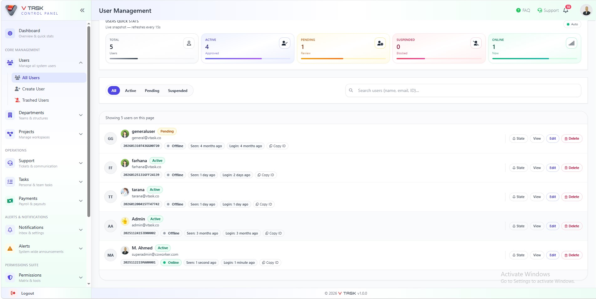

### User Details
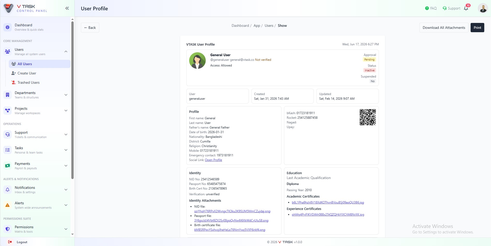

### User Permission Management
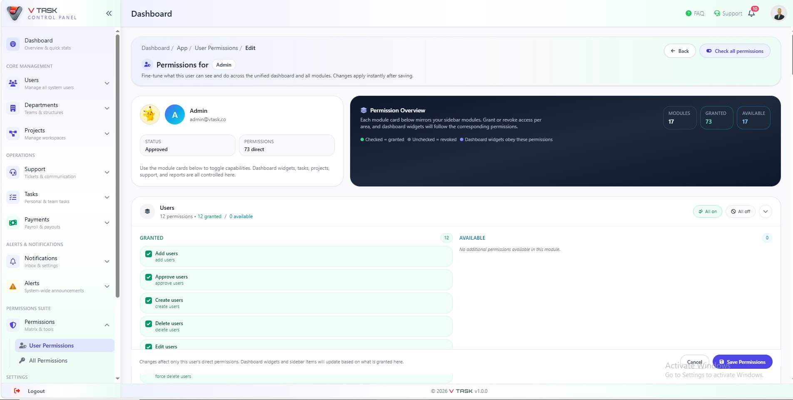

### User Profile
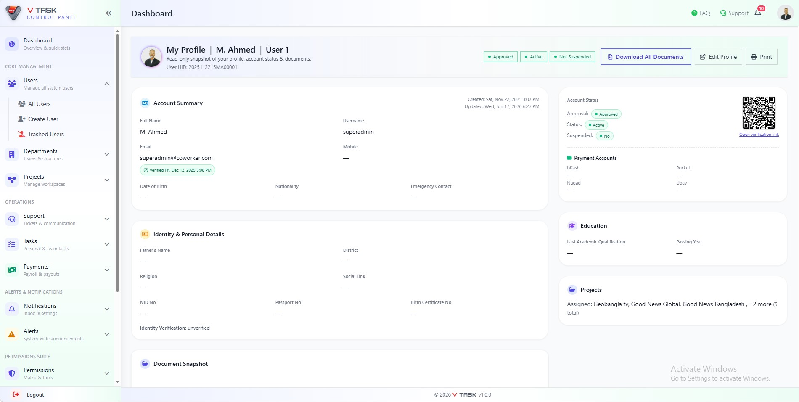

### Payment Management Module
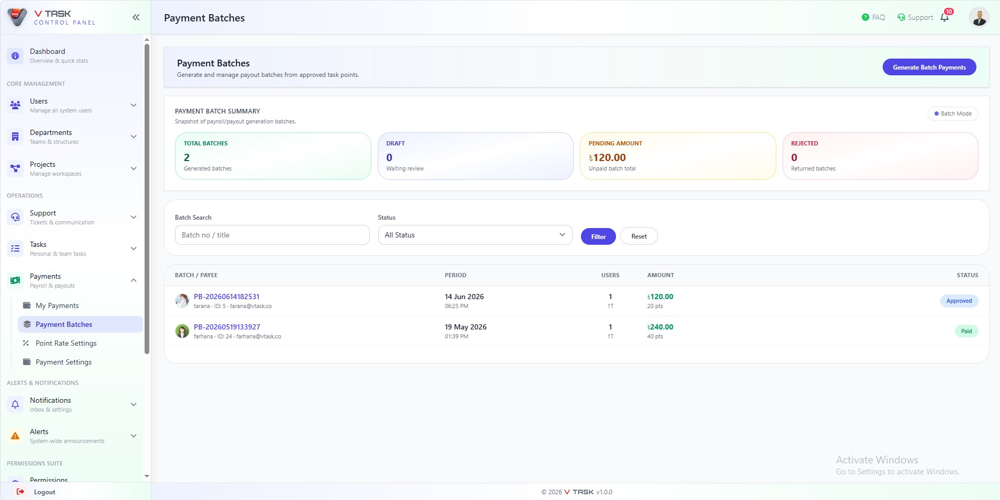

### Support Ticket System
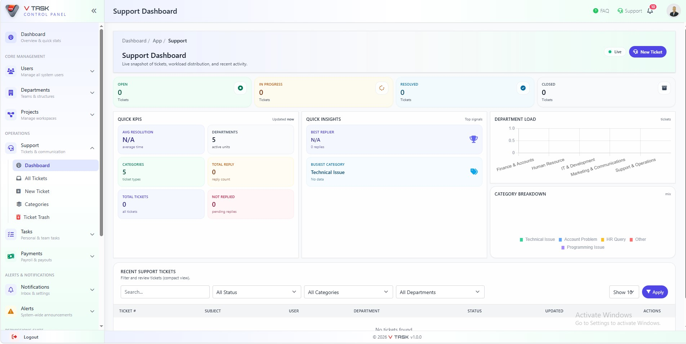

### Notification Center
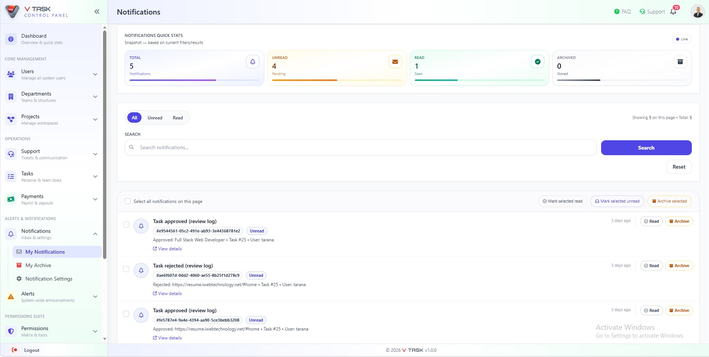

### Maintenance Center
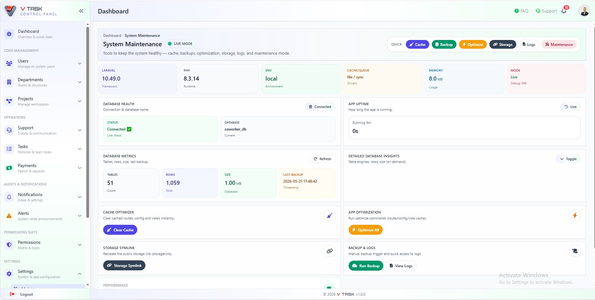

### Frontend Interface
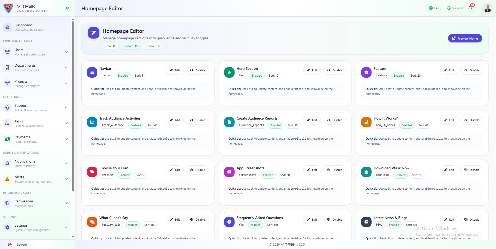

---

## Technology Stack

### Backend
- Laravel
- PHP
- RESTful API

### Frontend
- Blade Templates
- Tailwind CSS
- JavaScript
- Chart.js

### Database
- MySQL

### Development Tools
- Git
- GitHub
- Composer

---

## Core Features

### Workforce Management
- Employee Management
- Department Management
- User Profiles
- Team Structure Management

### Task & Workflow Management
- Task Assignment & Distribution
- Task Submission & Review
- Approval Workflow
- Performance Monitoring
- Productivity Tracking

### Support Management
- Support Ticket System
- Category-Based Ticket Handling
- Ticket Monitoring & Resolution Tracking

### Payment Management
- Point-Based Payment System
- Payment Batch Generation
- Payment Tracking & History
- Payment Reports

### Communication & Engagement
- Notifications
- Alerts & Announcements
- FAQ Management

### Reporting & Analytics
- Task Reports
- User Performance Reports
- Payment Reports
- Analytics Dashboard
- Operational Insights

### Security & Access Control
- Role-Based Access Control (RBAC)
- Authentication & Authorization
- Permission Management
- Audit Logging

---

## Project Highlights

✔ Enterprise-Grade Architecture  
✔ Multi-Panel Administration System  
✔ Workflow Automation Engine  
✔ Permission-Based Access Control  
✔ Database-Driven Reporting  
✔ Secure Authentication & Authorization  
✔ Scalable Laravel Framework  
✔ Modern Responsive User Interface  
✔ Organizational Performance Tracking  

---

## Developer

**Mojnou Ahmed**  
Lead Full Stack PHP Developer | Laravel Specialist | Software Engineer

🌐 Portfolio: https://resume.iwebtechnology.net  
💼 LinkedIn: https://www.linkedin.com/in/mojnou-ahmed  
🐙 GitHub: https://github.com/mojnouahmedcse
